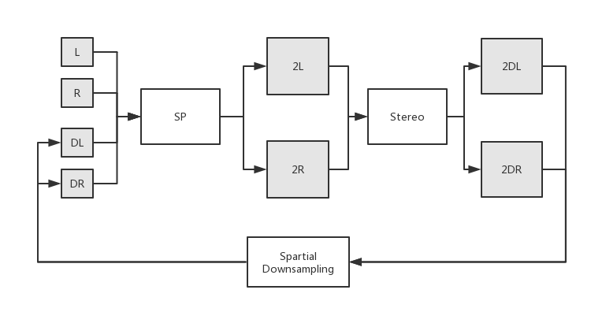

# Project Description

## Stereo

- Disparity displacement between left/right view, proportional to 1/Depth.
- Problem: 
    - Sub-pixel accuracy, floating number
    - Boundary
- Potential fix:
    - High resolution images
- Papers:
    - CSPN: [Depth Estimation via Affinity Learned with Convolutional Spatial Propagation Network](https://arxiv.org/abs/1808.00150) / [Learning Depth with Convolutional Spatial Propagation Network](https://arxiv.org/abs/1810.02695)
    - PSMNet: [Pyramid Stereo Matching Network](https://arxiv.org/abs/1803.08669)

## Super-resolution

- From low-res image to high-res image
- Approach: 
    - Single Image + Data-driven
    - Multiple images
- Paper:
    - EDSR: [Enhanced Deep Residual Networks for Single Image Super-Resolution](https://arxiv.org/abs/1707.02921)

## Connection

- If we have high-resolution images, we will have better disparity.
- If we have better disparity, we know how to combine two images to high-res.
- Iterative approach.
- Paper:
    - [DeepV2D: Video to Depth with Differentiable Structure from Motion](https://arxiv.org/abs/1812.04605)

## Architecture



## Implementation

- Iterative refinement is only done when testing.
- DeepV2D section 4 shows a good example on how to train this kind of network.

## Evaluation

- On Kitti 2012/2015, we NEED to achieve better disparity than others. ○ Data augmentation for resolution.
- We MAY achieve better super-resolution performance.
- We show disparity is improved over iterations.
- We do similar experiment on other datasets.

# Code

## Dependencies

- [Python3.6](https://www.python.org/downloads/)
- [PyTorch(1.0.0)](http://pytorch.org)
- torchvision 0.2.0
- [KITTI Stereo](http://www.cvlibs.net/datasets/kitti/eval_stereo.php)
- [Scene Flow](https://lmb.informatik.uni-freiburg.de/resources/datasets/SceneFlowDatasets.en.html)

```
Usage of Scene Flow dataset
Downlaod RGB cleanpass images and its disparity for three subset: FlyingThings3D, Driving, and Monkaa.
Put them in the same folder.
And rename the folder as: "driving_frames_cleanpass", "driving_disparity", "monkaa_frames_cleanpass", "monkaa_disparity", "frames_cleanpass", "frames_disparity".
```

## Train

### Stereo_train.py

- Firstly Stereo net is finetuned from the pretrained weights on datasets with both disparity maps. 
- The dataset is defaultly loaded from ../datasets. 
- Change current directory to project root folder and run the following Example: ```PYTHONPATH=./ python train/Stereo_train.py```